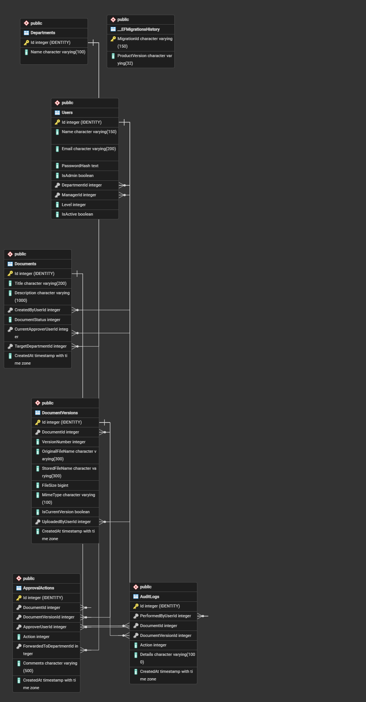
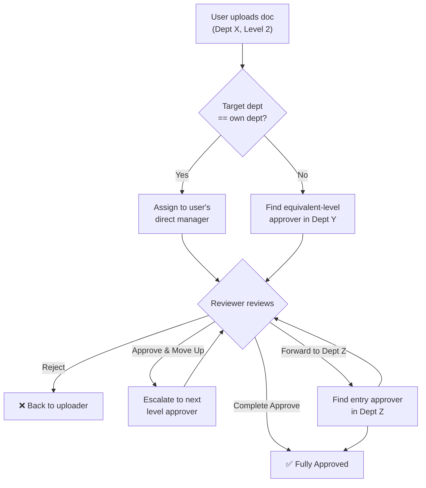

## ER Diagram

## 
## User Flow Diagram

---

## 🚀 Features Covered
- **Authentication**
  - **Secure Registration & Login:** Password protection using HMAC-SHA256 hashing.
  - **JWT Authorization:** Token generation carrying roles (`Admin`/`User`), department IDs, manager structures, and verification levels.
- **Document Control**
  - **MIME-Type Validation:** Checks physical file headers (PDF/JPEG/PNG) rather than extensions to prevent spoofing.
  - **Upload Limits:** Enforces a 5MB size limit on both client and server.
  - **Versioning & History:** Increments version number (e.g. `v1 -> v2`) upon re-uploading a rejected document.
  - **Access & Management:** Authors and reviewers can download physical version files or withdraw pending documents.
- **Approval Routing**
  - **Intra-departmental:** Automatically routes documents to the author's direct manager.
  - **Inter-departmental:** Routes cross-department uploads to target peers at the same level, balancing workload.
- **Review Actions**
  - **Approve Entirely:** Finalizes the approval chain immediately.
  - **Approve & Forward:** Approves and escalates the review to the reviewer's direct manager.
  - **Approve & Transfer:** Approves and transfers the review to a specific target user in a different department.
  - **Transfer:** Routes reviews peer-to-peer without requiring approval.
  - **Reject:** Rejects documents with a mandatory comment explaining the reason.
- **Admin Tools**
  - **Organizational Management:** Add/fetch departments and override user departments, levels, or managers.
  - **Safe User Deactivation:** Blocks deactivation if the user has pending approvals, pending uploads, or active subordinates.
  - **Reassign Documents:** Reassigns pending reviews from offboarding employees.
  - **Bulk CSV Upload:** Onboards users en masse with structure and validation checks.
- **System Diagnostics**
  - **Audit Logging:** Saves historical transactions (e.g., password changes, user registration, downloads) in the `AuditLogs` table.
  - **Application Logging:** Standard `ILogger` traces success path processes and records logic validation warning events.
  - **Rate Limiting:** Protects the endpoints from spam using fixed-window limits.
  - **Global Exception Handling:** Middleware parses unhandled issues into camelCase JSON API responses.
- **Testing**
  - **Unit Tests:** Full test suite utilizing NUnit and Moq covering database states, workflow edge cases, and exception testing.