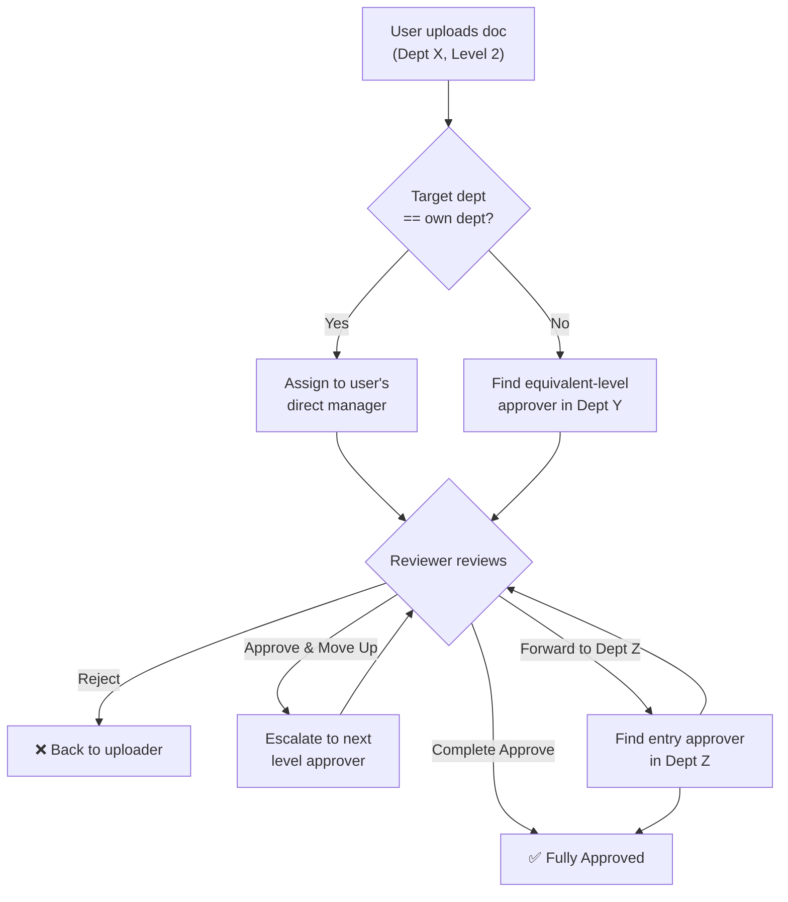

## ER Diagram

## 
## User Flow Diagram
### Multi-Department Flow (Mermaid)

```mermaid
flowchart TD
    A["User uploads doc<br/>(Dept X, Level 2)"] --> B{"Target dept<br/>== own dept?"}
    
    B -->|Yes| C["Assign to user's<br/>direct manager"]
    B -->|No| D["Find equivalent-level<br/>approver in Dept Y"]
    
    C --> E{"Reviewer reviews"}
    D --> E
    
    E -->|Reject| G["❌ Back to uploader"]
    E -->|Complete Approve| J["✅ Fully Approved"]
    
    E -->|Approve & Move Up| I["Escalate to next<br/>level approver"]
    E -->|Forward to Dept Z| H["Find entry approver<br/>in Dept Z"]
    
    I --> E
    H --> E     
    H --> J
```