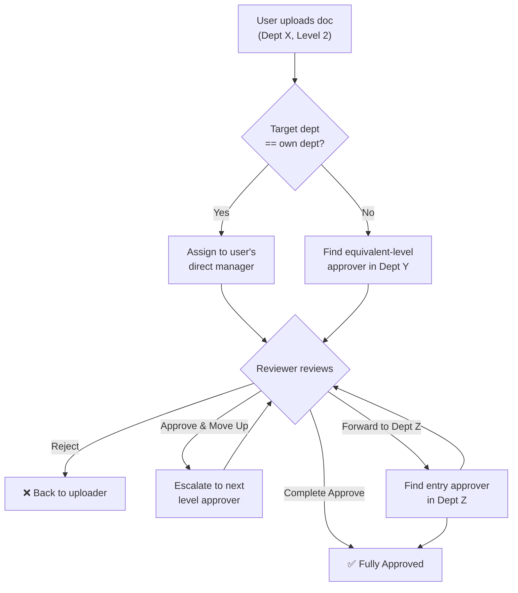

## ER Diagram

## 
## User Flow Diagram

---
## Prerequisites

To run and develop this project locally, ensure you have the following prerequisites installed:

### Backend (API)
- **.NET SDK**: `10.0` (Local version: `10.0.201`)
- **PostgreSQL Database**: `18.x` (Local version: `18.3`)

### Frontend
- **Node.js**: `v24.15.x` (Local version: `v24.15.0`)
- **npm**: `11.12.x` (Local version: `11.12.1`)
- **Angular CLI**: `21.2.x` (Local version: `21.2.7`)

### Testing
- **NUnit**: `4.3.2` (used for running backend unit and service tests)
- **Vitest**: `4.0.8` (used for running frontend tests)

