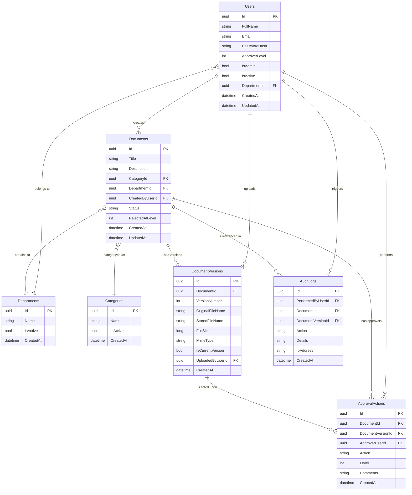

# Database Schema & API Routes Design
## Digital Document Approval Workflow System

**Date**: 2026-05-26  
**Status**: Draft — Pending Review

---

## Table of Contents

1. [Design Decisions](#1-design-decisions)
2. [ER Diagram](#2-er-diagram)
3. [Enum Definitions](#3-enum-definitions)
4. [Table Schemas](#4-table-schemas)
5. [Index Strategy](#5-index-strategy)
6. [Seed Data](#6-seed-data)
7. [API Route Specification](#7-api-route-specification)
8. [Business Rules Encoded in Schema](#8-business-rules-encoded-in-schema)

---

## 1. Design Decisions

### 1.1 Authentication
- **JWT access token only** — no refresh tokens.
- On token expiry, the client receives `401` and redirects to login.
- Token TTL: **60 minutes** (longer than typical since there's no refresh mechanism).
- JWT claims: `userId`, `email`, `fullName`, `roles[]`, `department`, `approverLevel`.

### 1.2 Roles vs. Approver Level
Your spec says "the approver level of user will be set by admin." Rather than a many-to-many roles table, we use a **single integer column** `ApproverLevel` on the `Users` table:

| `ApproverLevel` | Meaning |
|-----------------|---------|
| `0` | Creator only (no approval rights) |
| `1` | Can approve at L1 |
| `2` | Can approve at L1 **and** L2 |
| `3` | Can approve at L1, L2, **and** L3 |

> [!IMPORTANT]
> **Cumulative levels**: An L2 approver can also approve at L1. This avoids needing a separate roles junction table and simplifies queries. If you prefer **discrete levels** (L2 can only approve at L2, not L1), I'll adjust the schema.

### 1.3 Department-Scoped Approvals
- Each user belongs to a `Department`.
- When uploading a document, the uploader selects a **target department** (the department the document pertains to).
- Approvers see only documents where `Document.DepartmentId` matches **their own department** and the document is pending at a level they can approve.

### 1.4 Document Flow — No Explicit "Draft" State
Per your spec, uploading a document immediately enters it into the approval pipeline. There is no separate "Draft → Submit" step. On upload, the document status is set based on the uploader's `ApproverLevel` (see §8.1).

### 1.5 Version Tracking
- `Documents` table = root entity (title, description, category, department, status).
- `DocumentVersions` table = one row per file upload, linked to `Documents.Id`.
- `IsCurrentVersion` flag marks the active version; old versions are never deleted.

---

## 2. ER Diagram



---

## 3. Enum Definitions

These are defined as C# enums and stored as **strings** in PostgreSQL (using EF Core's `HasConversion<string>()`), making the database human-readable.

### 3.1 DocumentStatus

```csharp
public enum DocumentStatus
{
    PendingL1,
    PendingL2,
    PendingL3,
    ApprovedL1,
    ApprovedL2,
    ApprovedL3,   
    RejectedL1,
    RejectedL2,
    RejectedL3
}
```

### 3.2 ApprovalActionType

```csharp
public enum ApprovalActionType
{
    Approved,
    Rejected
}
```

### 3.3 AuditAction

```csharp
public enum AuditAction
{
    UserRegistered,
    UserLoggedIn,
    DocumentUploaded,       // First version (v1)
    NewVersionUploaded,     // v2, v3, ...
    DocumentApproved,
    DocumentRejected,
    DocumentDownloaded
}
```

---

## 4. Table Schemas

### 4.1 `Departments`

```sql
CREATE TABLE "Departments" (
    "Id"          UUID PRIMARY KEY DEFAULT gen_random_uuid(),
    "Name"        VARCHAR(100)  NOT NULL UNIQUE,
);
```

### 4.2 `Users`

```sql
CREATE TABLE "Users" (
    "Id"             UUID PRIMARY KEY DEFAULT gen_random_uuid(),
    "FullName"       VARCHAR(200)  NOT NULL,
    "Email"          VARCHAR(320)  NOT NULL UNIQUE,
    "PasswordHash"   VARCHAR(200)  NOT NULL,
    "ApproverLevel"  INT           NOT NULL DEFAULT 0,
        -- 0 = Creator only, 1 = L1, 2 = L2, 3 = L3
    "IsAdmin"        BOOLEAN       NOT NULL DEFAULT FALSE,
    "IsActive"       BOOLEAN       NOT NULL DEFAULT TRUE,
    "DepartmentId"   UUID          NOT NULL REFERENCES "Departments"("Id"),
    "CreatedAt"      TIMESTAMPTZ   NOT NULL DEFAULT NOW(),
    "UpdatedAt"      TIMESTAMPTZ   NOT NULL DEFAULT NOW()
);
```

> [!NOTE]
> `ApproverLevel` is **cumulative**: a user with `ApproverLevel = 2` can approve documents at levels 1 and 2. The admin sets this value.


### 4.4 `Documents`

```sql
CREATE TABLE "Documents" (
    "Id"               UUID PRIMARY KEY DEFAULT gen_random_uuid(),
    "Title"            VARCHAR(200)  NOT NULL,
    "Description"      VARCHAR(2000) NOT NULL,
    "DepartmentId"     UUID          NOT NULL REFERENCES "Departments"("Id"),
    "CreatedByUserId"  UUID          NOT NULL REFERENCES "Users"("Id"),
    "Status"           VARCHAR(20)   NOT NULL,
        -- PendingL1, PendingL2, PendingL3, ApprovedL1, ApprovedL2, ApprovedL3,
        -- RejectedL1, RejectedL2, RejectedL3
    "RejectedAtLevel"  INT          NULL,
        -- Set to 1, 2, or 3 when rejected; NULL when not in rejected state
    "CreatedAt"        TIMESTAMPTZ   NOT NULL DEFAULT NOW(),
    "UpdatedAt"        TIMESTAMPTZ   NOT NULL DEFAULT NOW()
);
```

**Key columns explained:**

| Column | Purpose |
|--------|---------|
| `DepartmentId` | The department this document is uploaded for (chosen by uploader). Determines which approvers see it. |
| `Status` | Current position in the approval pipeline. |
| `RejectedAtLevel` | When a document is rejected, stores the level (1/2/3). Used to determine re-entry point on reupload. Reset to `NULL` when document re-enters the pipeline. |

### 4.5 `DocumentVersions`

```sql
CREATE TABLE "DocumentVersions" (
    "Id"                UUID PRIMARY KEY DEFAULT gen_random_uuid(),
    "DocumentId"        UUID          NOT NULL REFERENCES "Documents"("Id"),
    "VersionNumber"     INT           NOT NULL,
    "OriginalFileName"  VARCHAR(500)  NOT NULL,
    "StoredFileName"    VARCHAR(500)  NOT NULL,
        -- GUID-based: e.g., "a3f2b1c4-xxxx.pdf"
    "FileSize"          BIGINT        NOT NULL,
    "MimeType"          VARCHAR(200)  NOT NULL,
    "IsCurrentVersion"  BOOLEAN       NOT NULL DEFAULT FALSE,
    "UploadedByUserId"  UUID          NOT NULL REFERENCES "Users"("Id"),
    "CreatedAt"         TIMESTAMPTZ   NOT NULL DEFAULT NOW(),

    CONSTRAINT "UQ_DocumentVersion" UNIQUE ("DocumentId", "VersionNumber")
);
```

> [!IMPORTANT]
> The `UNIQUE ("DocumentId", "VersionNumber")` constraint prevents race conditions where two concurrent uploads could create duplicate version numbers for the same document.

### 4.6 `ApprovalActions`

```sql
CREATE TABLE "ApprovalActions" (
    "Id"                 UUID PRIMARY KEY DEFAULT gen_random_uuid(),
    "DocumentId"         UUID          NOT NULL REFERENCES "Documents"("Id"),
    "DocumentVersionId"  UUID          NOT NULL REFERENCES "DocumentVersions"("Id"),
    "ApproverUserId"     UUID          NOT NULL REFERENCES "Users"("Id"),
    "Action"             VARCHAR(20)   NOT NULL,
        -- 'Approved' or 'Rejected'
    "Level"              INT           NOT NULL,
        -- 1, 2, or 3
    "Comments"           VARCHAR(2000) NULL,
        -- Mandatory for rejection, optional for approval
    "CreatedAt"          TIMESTAMPTZ   NOT NULL DEFAULT NOW()
);
```

> [!NOTE]
> This table is append-only in practice — we never update or delete rows. Each approve/reject creates a new record, building a full audit trail of all approval decisions.

### 4.7 `AuditLogs`

```sql
CREATE TABLE "AuditLogs" (
    "Id"                 UUID PRIMARY KEY DEFAULT gen_random_uuid(),
    "PerformedByUserId"  UUID          NOT NULL REFERENCES "Users"("Id"),
    "DocumentId"         UUID          NULL REFERENCES "Documents"("Id"),
    "DocumentVersionId"  UUID          NULL REFERENCES "DocumentVersions"("Id"),
    "Action"             VARCHAR(50)   NOT NULL,
        -- Enum values from AuditAction
    "Details"            VARCHAR(2000) NULL,
        -- Contextual info: "Rejected at L2", "Version v3 uploaded", etc.
    "IpAddress"          VARCHAR(50)   NULL,
    "CreatedAt"          TIMESTAMPTZ   NOT NULL DEFAULT NOW()
);
```

> [!CAUTION]
> **Append-only table.** No UPDATE or DELETE operations are permitted on this table. The repository and service layers must enforce this — there should be no `Update()` or `Delete()` methods for `AuditLog` entities.

---

## 5. Index Strategy

```sql
-- Users
CREATE INDEX "IX_Users_Email"         ON "Users" ("Email");
CREATE INDEX "IX_Users_DepartmentId"  ON "Users" ("DepartmentId");
CREATE INDEX "IX_Users_ApproverLevel" ON "Users" ("ApproverLevel") WHERE "IsActive" = TRUE;

-- Documents
CREATE INDEX "IX_Documents_Status"           ON "Documents" ("Status");
CREATE INDEX "IX_Documents_CreatedByUserId"  ON "Documents" ("CreatedByUserId");
CREATE INDEX "IX_Documents_CategoryId"       ON "Documents" ("CategoryId");
CREATE INDEX "IX_Documents_DepartmentId"     ON "Documents" ("DepartmentId");
CREATE INDEX "IX_Documents_Status_Dept"      ON "Documents" ("Status", "DepartmentId");
    -- Critical for approval queue: WHERE Status = 'PendingL1' AND DepartmentId = ?

-- DocumentVersions
CREATE INDEX "IX_DocVersions_DocumentId"        ON "DocumentVersions" ("DocumentId");
CREATE INDEX "IX_DocVersions_IsCurrentVersion"  ON "DocumentVersions" ("DocumentId", "IsCurrentVersion")
    WHERE "IsCurrentVersion" = TRUE;

-- ApprovalActions
CREATE INDEX "IX_ApprovalActions_DocumentId"     ON "ApprovalActions" ("DocumentId");
CREATE INDEX "IX_ApprovalActions_ApproverUserId" ON "ApprovalActions" ("ApproverUserId");

-- AuditLogs
CREATE INDEX "IX_AuditLogs_PerformedByUserId" ON "AuditLogs" ("PerformedByUserId");
CREATE INDEX "IX_AuditLogs_DocumentId"        ON "AuditLogs" ("DocumentId") WHERE "DocumentId" IS NOT NULL;
CREATE INDEX "IX_AuditLogs_Action"            ON "AuditLogs" ("Action");
CREATE INDEX "IX_AuditLogs_CreatedAt"         ON "AuditLogs" ("CreatedAt");
```

> [!TIP]
> The **composite index** `IX_Documents_Status_Dept` is the most performance-critical index. The approver queue query is: *"find all documents with `Status = PendingLN` where `DepartmentId = myDepartment`"* — this index makes that query a fast index scan.

---

## 6. Seed Data

### 6.1 Departments

```sql
INSERT INTO "Departments" ("Name") VALUES
    ('Finance'),
    ('Human Resources'),
    ('Legal'),
    ('Technical'),
    ('Operations'),
    ('General');
```

### 6.2 Categories

```sql
INSERT INTO "Categories" ("Name") VALUES
    ('Legal'),
    ('HR'),
    ('Finance'),
    ('Technical'),
    ('General'),
    ('Compliance'),
    ('Operations');
```

### 6.3 Admin User

```sql
-- Password: Admin@123 (BCrypt hash)
INSERT INTO "Users" ("FullName", "Email", "PasswordHash", "ApproverLevel", "IsAdmin", "DepartmentId")
VALUES (
    'System Admin',
    'admin@edms.com',
    '$2a$11$...',  -- BCrypt hash computed at runtime during seeding
    0,
    TRUE,
    (SELECT "Id" FROM "Departments" WHERE "Name" = 'General')
);
```

---

## 7. API Route Specification

### 7.1 Authentication — `/api/auth`

| Method | Route | Auth | Request Body | Response | Description |
|--------|-------|------|-------------|----------|-------------|
| `POST` | `/api/auth/register` | Public | `{ fullName, email, password, departmentId }` | `{ userId, message }` | Register new user. Auto-assigned as Creator (ApproverLevel=0). |
| `POST` | `/api/auth/login` | Public | `{ email, password }` | `{ token, expiresAt, user: { id, fullName, email, department, approverLevel, isAdmin } }` | Returns JWT access token. No refresh token. |

> [!NOTE]
> **No refresh token.** When the JWT expires, the frontend intercepts the `401` response globally (via an Angular HTTP interceptor) and redirects to the login page.

---

### 7.2 Users — `/api/users`

| Method | Route | Auth | Description |
|--------|-------|------|-------------|
| `GET` | `/api/users/me` | Authenticated | Get current user's profile, department, approverLevel, isAdmin |
| `GET` | `/api/users` | Admin | List all users (paginated). Query params: `?page=1&pageSize=20&department=&search=` |
| `GET` | `/api/users/{id}` | Admin | Get specific user details |
| `PUT` | `/api/users/{id}/approver-level` | Admin | Set a user's approver level. Body: `{ approverLevel: 0|1|2|3 }` |
| `PUT` | `/api/users/{id}/admin-status` | Admin | Toggle admin status. Body: `{ isAdmin: true|false }` |
| `PUT` | `/api/users/{id}/status` | Admin | Activate/deactivate user. Body: `{ isActive: true|false }` |

**Example: Set Approver Level**
```
PUT /api/users/3f2a1b4c-.../approver-level
Authorization: Bearer <admin-jwt>

{ "approverLevel": 2 }
```

**Service layer behaviour:**
- Validates the target user exists and is active.
- Updates `Users.ApproverLevel`.
- Logs `AuditAction.RoleAssigned` (or a new audit action like `ApproverLevelChanged`).

---

### 7.3 Documents — `/api/documents`

| Method | Route | Auth | Description |
|--------|-------|------|-------------|
| `POST` | `/api/documents` | Authenticated | Upload new document (multipart/form-data) |
| `GET` | `/api/documents` | Authenticated | List documents (see filtering below) |
| `GET` | `/api/documents/{id}` | Authenticated | Get document detail + current version + approval history |
| `GET` | `/api/documents/{id}/download` | Authenticated | Download the current version's file |

#### `POST /api/documents` — Upload New Document

**Request**: `multipart/form-data`

| Field | Type | Required | Constraints |
|-------|------|----------|-------------|
| `title` | string | ✅ | Max 200 chars |
| `description` | string | ✅ | Max 2000 chars |
| `categoryId` | UUID | ✅ | Must reference an active Category |
| `departmentId` | UUID | ✅ | Must reference an active Department (the department this doc pertains to) |
| `file` | binary | ✅ | MIME validated via magic bytes. Max 10MB. |

**Server-side flow:**
1. Validate MIME type via magic bytes (not extension, not `Content-Type` header).
2. Create `Documents` record with status determined by uploader's `ApproverLevel`:

   | Uploader's `ApproverLevel` | Initial `Status` |
   |---------------------------|-----------------|
   | 0 (Creator only) | `PendingL1` |
   | 1 | `PendingL2` |
   | 2 | `PendingL3` |
   | 3 | `ApprovedL3` (auto-approved) |

3. Create `DocumentVersions` record with `VersionNumber = 1`, `IsCurrentVersion = true`.
4. Store file with GUID-based name on disk.
5. Create `AuditLogs` entry: `DocumentUploaded`.

**Response**: `201 Created`
```json
{
    "success": true,
    "data": {
        "documentId": "...",
        "versionId": "...",
        "versionNumber": 1,
        "status": "PendingL1",
        "message": "Document uploaded successfully"
    }
}
```

#### `GET /api/documents` — List Documents

**Query Parameters:**

| Param | Type | Default | Description |
|-------|------|---------|-------------|
| `page` | int | 1 | Page number |
| `pageSize` | int | 20 | Items per page (max 100) |
| `status` | string | — | Filter by status: `uploaded`, `approved`, `rejected`, or exact status |
| `categoryId` | UUID | — | Filter by category |
| `departmentId` | UUID | — | Filter by department |
| `search` | string | — | Search in title/description |
| `sortBy` | string | `createdAt` | Sort field |
| `sortOrder` | string | `desc` | `asc` or `desc` |
| `view` | string | `my` | `my` (own docs), `pending` (approval queue), `all` (admin) |

**View logic:**

| `view` | Who can use | What it returns |
|--------|-------------|-----------------|
| `my` | Any authenticated user | Documents where `CreatedByUserId = currentUser` |
| `pending` | Users with `ApproverLevel >= 1` | Documents where `Status = PendingLN` (N ≤ user's level) AND `DepartmentId = user's department` AND `CreatedByUserId ≠ currentUser` |
| `all` | Admin only | All documents |

**Status shorthand filters:**
- `status=uploaded` → Status IN (`PendingL1`, `PendingL2`, `PendingL3`, `ApprovedL1`, `ApprovedL2`) — docs in the pipeline
- `status=approved` → Status = `ApprovedL3` — fully approved
- `status=rejected` → Status IN (`RejectedL1`, `RejectedL2`, `RejectedL3`)

**Response**: `200 OK`
```json
{
    "success": true,
    "data": {
        "items": [
            {
                "id": "...",
                "title": "Q4 Budget Report",
                "description": "...",
                "category": { "id": "...", "name": "Finance" },
                "department": { "id": "...", "name": "Finance" },
                "status": "PendingL2",
                "currentVersion": {
                    "versionNumber": 2,
                    "fileName": "budget_report_v2.pdf",
                    "fileSize": 1048576,
                    "uploadedAt": "2026-05-25T10:30:00Z"
                },
                "createdBy": { "id": "...", "fullName": "Jane Doe" },
                "createdAt": "2026-05-20T08:00:00Z"
            }
        ],
        "page": 1,
        "pageSize": 20,
        "totalCount": 42,
        "totalPages": 3
    }
}
```

---

### 7.4 Document Versions — `/api/documents/{id}/versions`

| Method | Route | Auth | Description |
|--------|-------|------|-------------|
| `GET` | `/api/documents/{id}/versions` | Authenticated | List all versions of a document (v1, v2, ...) |
| `POST` | `/api/documents/{id}/versions` | Authenticated (owner only) | Upload a new version (only allowed when document is in `Rejected*` status) |
| `GET` | `/api/documents/{id}/versions/{versionId}/download` | Authenticated | Download a specific version |

#### `POST /api/documents/{id}/versions` — Upload New Version (Reupload after Rejection)

**Preconditions:**
- Document must be in a `Rejected*` status (`RejectedL1`, `RejectedL2`, `RejectedL3`).
- Only the document's original creator (`CreatedByUserId`) can upload a new version.

**Request**: `multipart/form-data`

| Field | Type | Required | Description |
|-------|------|----------|-------------|
| `file` | binary | ✅ | New file (MIME validated) |
| `title` | string | ❌ | Optionally update title |
| `description` | string | ❌ | Optionally update description |

**Server-side flow:**
1. Validate the document is in a `Rejected*` status.
2. Validate MIME type of the new file.
3. Set previous version's `IsCurrentVersion = false`.
4. Create new `DocumentVersions` record: `VersionNumber = previous + 1`, `IsCurrentVersion = true`.
5. Determine the re-entry status:

   ```
   rejectedLevel = Document.RejectedAtLevel     // e.g., 2
   roleBasedEntry = uploader.ApproverLevel + 1   // e.g., if ApproverLevel=1, entry=2
   effectiveEntry = MAX(rejectedLevel, roleBasedEntry)
   newStatus = PendingL{effectiveEntry}
   ```

   | `RejectedAtLevel` | Uploader's `ApproverLevel` | Re-entry Status |
   |-------------------|---------------------------|-----------------|
   | 1 | 0 | `PendingL1` |
   | 1 | 1 | `PendingL2` (role-based ≥ rejection) |
   | 2 | 0 | `PendingL2` |
   | 2 | 1 | `PendingL2` |
   | 2 | 2 | `PendingL3` (role-based ≥ rejection) |
   | 3 | 0 | `PendingL3` |
   | 3 | 2 | `PendingL3` |

6. Update `Documents.Status` to the re-entry status, set `RejectedAtLevel = NULL`.
7. Log `AuditAction.NewVersionUploaded`.

**Response**: `201 Created`
```json
{
    "success": true,
    "data": {
        "documentId": "...",
        "versionId": "...",
        "versionNumber": 3,
        "status": "PendingL2",
        "message": "New version uploaded. Approval resumes at Level 2."
    }
}
```

#### `GET /api/documents/{id}/versions` — List All Versions

**Response**: `200 OK`
```json
{
    "success": true,
    "data": [
        {
            "id": "...",
            "versionNumber": 3,
            "originalFileName": "budget_v3.pdf",
            "fileSize": 2097152,
            "mimeType": "application/pdf",
            "isCurrentVersion": true,
            "uploadedBy": { "id": "...", "fullName": "Jane Doe" },
            "createdAt": "2026-05-25T14:00:00Z"
        },
        {
            "id": "...",
            "versionNumber": 2,
            "originalFileName": "budget_v2.pdf",
            "fileSize": 1048576,
            "mimeType": "application/pdf",
            "isCurrentVersion": false,
            "uploadedBy": { "id": "...", "fullName": "Jane Doe" },
            "createdAt": "2026-05-23T09:00:00Z"
        },
        {
            "id": "...",
            "versionNumber": 1,
            "originalFileName": "budget_report.pdf",
            "fileSize": 512000,
            "mimeType": "application/pdf",
            "isCurrentVersion": false,
            "uploadedBy": { "id": "...", "fullName": "Jane Doe" },
            "createdAt": "2026-05-20T08:00:00Z"
        }
    ]
}
```

---

### 7.5 Approval Actions — `/api/documents/{id}/approval`

| Method | Route | Auth | Description |
|--------|-------|------|-------------|
| `POST` | `/api/documents/{id}/approval/approve` | Approver (matching level + department) | Approve the document at its current pending level |
| `POST` | `/api/documents/{id}/approval/reject` | Approver (matching level + department) | Reject the document (comment mandatory) |
| `GET` | `/api/documents/{id}/approval/history` | Authenticated | Full chronological approval/rejection history |

#### `POST /api/documents/{id}/approval/approve`

**Request:**
```json
{
    "comment": "Looks good. Approved."
}
```

**Preconditions (enforced in service layer):**
1. Document must be in `PendingL1`, `PendingL2`, or `PendingL3`.
2. Current user's `ApproverLevel` must be `>=` the pending level.
3. Current user's `DepartmentId` must match `Document.DepartmentId`.
4. Current user must NOT be the document's creator (`CreatedByUserId ≠ currentUser`).

**Status transitions:**

| Current Status | After Approval | After Approval (next step) |
|---------------|---------------|---------------------------|
| `PendingL1` | `ApprovedL1` | Auto-advances to `PendingL2` |
| `PendingL2` | `ApprovedL2` | Auto-advances to `PendingL3` |
| `PendingL3` | `ApprovedL3` | **Terminal state** — fully approved |

> [!IMPORTANT]
> On L1 or L2 approval, the system **automatically advances** the document to the next pending level in a single transaction. So a document goes from `PendingL1` → `ApprovedL1` → `PendingL2` atomically. The `ApprovedL1` status is recorded in the `ApprovalActions` table but the `Documents.Status` column moves directly to `PendingL2`.

**Server-side flow:**
1. Validate all preconditions.
2. Create `ApprovalActions` record: `Action = Approved`, `Level = N`.
3. If level < 3: update `Documents.Status` to `PendingL{N+1}`.
4. If level = 3: update `Documents.Status` to `ApprovedL3`.
5. Log `AuditAction.DocumentApproved`.

**Response**: `200 OK`
```json
{
    "success": true,
    "data": {
        "documentId": "...",
        "previousStatus": "PendingL2",
        "newStatus": "PendingL3",
        "approvedBy": "John Smith",
        "approvedAt": "2026-05-26T10:30:00Z"
    }
}
```

#### `POST /api/documents/{id}/approval/reject`

**Request:**
```json
{
    "comment": "Section 3 has incorrect figures. Please revise and reupload."
}
```

> [!WARNING]
> `comment` is **mandatory** for rejection. A missing or empty comment returns `400 Bad Request`.

**Server-side flow:**
1. Validate all preconditions (same as approve).
2. Validate that `comment` is non-empty.
3. Create `ApprovalActions` record: `Action = Rejected`, `Level = N`.
4. Update `Documents.Status` to `RejectedL{N}`.
5. Update `Documents.RejectedAtLevel` to `N`.
6. Log `AuditAction.DocumentRejected` with the comment in `Details`.

**Response**: `200 OK`
```json
{
    "success": true,
    "data": {
        "documentId": "...",
        "previousStatus": "PendingL2",
        "newStatus": "RejectedL2",
        "rejectedBy": "John Smith",
        "rejectedAt": "2026-05-26T11:00:00Z",
        "comment": "Section 3 has incorrect figures. Please revise and reupload."
    }
}
```

#### `GET /api/documents/{id}/approval/history`

**Response**: `200 OK`
```json
{
    "success": true,
    "data": [
        {
            "id": "...",
            "action": "Approved",
            "level": 1,
            "comment": "Looks good.",
            "approver": { "id": "...", "fullName": "Alice Johnson" },
            "versionNumber": 1,
            "createdAt": "2026-05-21T09:00:00Z"
        },
        {
            "id": "...",
            "action": "Rejected",
            "level": 2,
            "comment": "Incorrect figures in section 3.",
            "approver": { "id": "...", "fullName": "John Smith" },
            "versionNumber": 1,
            "createdAt": "2026-05-22T14:00:00Z"
        },
        {
            "id": "...",
            "action": "Approved",
            "level": 2,
            "comment": "Revised version looks correct.",
            "approver": { "id": "...", "fullName": "John Smith" },
            "versionNumber": 2,
            "createdAt": "2026-05-24T10:00:00Z"
        }
    ]
}
```

---

### 7.6 Categories — `/api/categories`

| Method | Route | Auth | Description |
|--------|-------|------|-------------|
| `GET` | `/api/categories` | Authenticated | List all active categories (for dropdowns) |
| `POST` | `/api/categories` | Admin | Create a new category. Body: `{ name }` |
| `PUT` | `/api/categories/{id}` | Admin | Update category name. Body: `{ name }` |
| `DELETE` | `/api/categories/{id}` | Admin | Delete category (fails `409` if documents reference it) |

---

### 7.7 Departments — `/api/departments`

| Method | Route | Auth | Description |
|--------|-------|------|-------------|
| `GET` | `/api/departments` | Authenticated | List all active departments (for dropdowns) |
| `POST` | `/api/departments` | Admin | Create a new department. Body: `{ name }` |
| `PUT` | `/api/departments/{id}` | Admin | Update department name. Body: `{ name }` |
| `DELETE` | `/api/departments/{id}` | Admin | Delete department (fails `409` if users or documents reference it) |

---

### 7.8 Audit Logs — `/api/audit-logs`

| Method | Route | Auth | Description |
|--------|-------|------|-------------|
| `GET` | `/api/audit-logs` | Admin | List all audit logs (paginated, filterable) |
| `GET` | `/api/audit-logs/my` | Authenticated | Current user's own audit trail |
| `GET` | `/api/audit-logs/document/{documentId}` | Authenticated (must have access to document) | Audit trail for a specific document |

**Query Parameters (for all 3 endpoints):**

| Param | Type | Default | Description |
|-------|------|---------|-------------|
| `page` | int | 1 | Page number |
| `pageSize` | int | 20 | Items per page |
| `action` | string | — | Filter by action type |
| `fromDate` | datetime | — | Start date |
| `toDate` | datetime | — | End date |

---

### 7.9 Dashboard Stats — `/api/dashboard`

| Method | Route | Auth | Description |
|--------|-------|------|-------------|
| `GET` | `/api/dashboard/stats` | Authenticated | Returns summary counts for the current user |

**Response:**
```json
{
    "success": true,
    "data": {
        "myDocuments": {
            "total": 15,
            "pending": 5,
            "approved": 8,
            "rejected": 2
        },
        "pendingMyApproval": 7,
        "recentActivity": [
            {
                "action": "DocumentApproved",
                "documentTitle": "Q4 Budget",
                "performedBy": "Alice Johnson",
                "createdAt": "2026-05-26T10:30:00Z"
            }
        ]
    }
}
```

---

### Endpoint Summary

| Group | Count | Routes |
|-------|-------|--------|
| Auth | 2 | register, login |
| Users | 6 | me, list, detail, approver-level, admin-status, status |
| Documents | 4 | upload, list, detail, download |
| Document Versions | 3 | list, upload new version, download specific |
| Approval Actions | 3 | approve, reject, history |
| Categories | 4 | list, create, update, delete |
| Departments | 4 | list, create, update, delete |
| Audit Logs | 3 | all, my, by-document |
| Dashboard | 1 | stats |
| **Total** | **30** | |

---

## 8. Business Rules Encoded in Schema

### 8.1 Document Entry Level (on initial upload)

```
entryLevel = uploader.ApproverLevel + 1

if entryLevel > 3:
    status = ApprovedL3  (auto-approved)
else:
    status = PendingL{entryLevel}
```

### 8.2 Rejection Re-entry (on version reupload)

```
rejectedLevel  = document.RejectedAtLevel      // e.g., 2
roleBasedEntry = uploader.ApproverLevel + 1     // e.g., 2
effectiveEntry = MAX(rejectedLevel, roleBasedEntry)
newStatus      = PendingL{effectiveEntry}
```

### 8.3 Approval Queue Visibility (department-scoped)

```sql
-- Approver with ApproverLevel=2 in Finance department sees:
SELECT d.*
FROM "Documents" d
WHERE d."Status" IN ('PendingL1', 'PendingL2')      -- levels ≤ their level
  AND d."DepartmentId" = @approverDepartmentId       -- same department
  AND d."CreatedByUserId" != @currentUserId          -- can't approve own docs
ORDER BY d."CreatedAt" ASC;
```

### 8.4 Self-Approval Prevention

```
IF document.CreatedByUserId == currentUser.Id THEN
    REJECT with 403: "Cannot approve your own document"
```

### 8.5 MIME Validation via Magic Bytes

| MIME Type | Magic Bytes (Hex) |
|-----------|-------------------|
| `application/pdf` | `25 50 44 46` (`%PDF`) |
| `application/msword` | `D0 CF 11 E0 A1 B1 1A E1` (OLE2 header) |
| `application/vnd.openxmlformats-*` (.docx, .xlsx, .pptx) | `50 4B 03 04` (PK/ZIP header) |

> [!NOTE]
> `.docx`, `.xlsx`, and `.pptx` are all ZIP-based formats sharing the same magic bytes. After detecting the ZIP header, the service layer must inspect the ZIP's internal structure (specifically `[Content_Types].xml`) to determine the exact Office format.

---

## Open Questions

> [!IMPORTANT]
> ### Q1: Cumulative vs. Discrete Approver Levels
> Should an `ApproverL2` user be able to approve at **both** L1 and L2 (cumulative), or **only** at L2 (discrete)?  
> - **Cumulative** (current design): Simpler schema, fewer approvers needed. An L2 user appears in both L1 and L2 queues.  
> - **Discrete**: More granular control, but requires more approver assignments.

> [!IMPORTANT]
> ### Q2: Auto-Advance on Approval
> When an L1 approver approves a document, the `Documents.Status` column jumps directly from `PendingL1` to `PendingL2` (the intermediate `ApprovedL1` is only recorded in the `ApprovalActions` table). Is this acceptable, or should the UI show the intermediate `ApprovedL1` status?

> [!IMPORTANT]
> ### Q3: Document Department vs. Category
> The current design has **both** a `DepartmentId` (determines which approvers see the document) and a `CategoryId` (metadata classification like Legal, Technical, etc.). These are separate concepts:
> - **Department**: Organizational unit whose approvers handle the document.
> - **Category**: Content classification for filtering/reporting.
>
> Is this distinction correct, or should category alone drive approver visibility?
